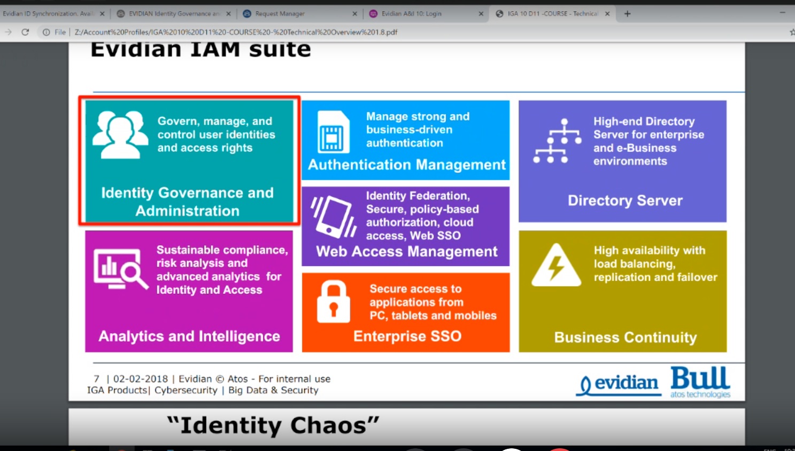

synchro ldap

les acès doit etre géré en fontion des départs, nouveaux recrutement

livre des ressources humaine pour avoir une seule occurence => applique le meme principe en entreprise un seul objet dans lidentite ldap

- un humain doit posséder un seul objet didentité classe inetorgperson ou organizationalperson 
    - Si on veut le stocker avec le meme on ne doit retrouver le meme (en gros comme garder avec le meme dossier)

- il faut un logiciel : 
    - identity top management *software*
- 

- les informations que l'on stocke sont tès importantes dans l'annuiare ldap
    -     

- ldap peut contrôler les gestions à double authnetification,  et des habitudes

    - récupération des mots de passes, l'admin ne peut pas déchiffrer le mot de passe spéifique à un utilisateur mais globalement, 
        - LDAPS ; HTTPS ; tunnel sécurisé pour envoyer le mdp
        - renouveler le mot de passe 
            - le mdp sera enregistré dans l'annuaire ldap en mode chiffré et
                - il aura la clé de déchiffrement et chiffrement
                - clé publique déchiffre
                    - clé privée déchiffre

- on innove dans la clé de chiffrement avec le mdp AD + un code spécial pour combiner le mdp utilisateur
    - seul l'utilisateur peut accéder à son coffre fort
    - sauf en cas d'accord avec le juge lediteur/lentreprise peut dehiffrer le mdp specifique dun utilisateur
    - très important
    - déchiffre avec les infos et le code pin et tt ce couple

-  ut

- Microsoft ad ou **Ad-Lds** : authentification
    - 	Gss-api (protocole d’authentification et de chiffrement)    
- Ldap :
    - 	Simple-authentification
Généralement on choisit la racine de notre base

garantir la sécurité 

badpasswordtime : temps à la prochaine fois mdp bloqué

passwdlastset: interdit dutiliser lancien mdp

l'annuaire ldap fait la diff entre le chemin et la page web fait la corréalation pour pointer et afficer le prenom du manager

des systèmes de synchro : 
